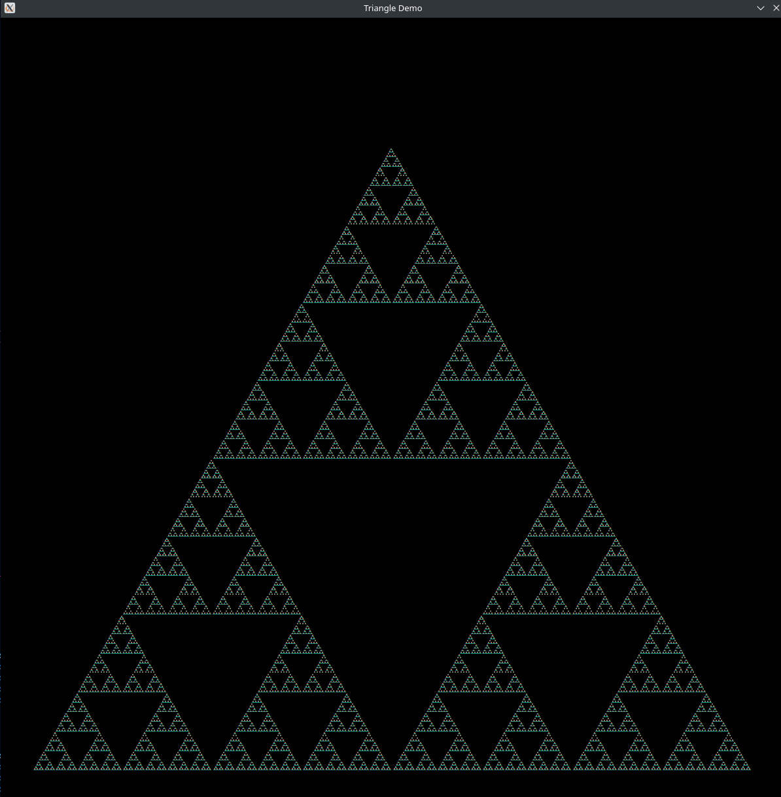

# sierpinski

A demo of the Sierpinski Triangles fractal written in Ruby, rendered with Ruby2D.

## Screenshot:



## Installation

```bash
$ ~ gem install ruby2d
$ ~ git clone https://github.com/cultureshocked/sierpinski
$ ~ cd sierpinski
$ ~/sierpinski ruby sierpinski.rb
```

## Dependencies

`ruby2d` is the only external gem that this program uses.

However, `ruby2d` depends on SDL2 being installed on your system. Since `ruby2d` is built from source for all of its native SDL2 binaries, this means that it may also depend on the `*-devel` versions, varying from distro to distro.

I can't offer support for non-Arch Linux systems at this time, but this is how I would install the packages required on my system:

```bash
$ ~ sudo pacman -S sdl2
$ ~ gem install ruby2d
```

## Testing

This project is being developed with the DDT paradigm for testing, as my last project was built with TDD ([heapq-ruby](https://github.com/cultureshocked/heapq-ruby))

As of right now, there are no unit tests; there is only a working prototype of the program.

## License

GPLv3
